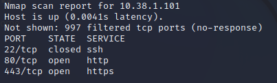
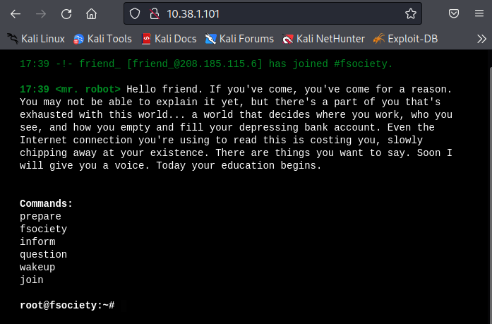
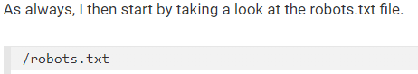
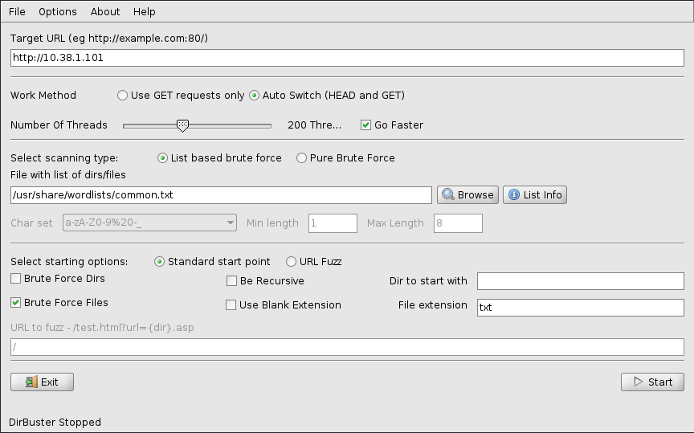
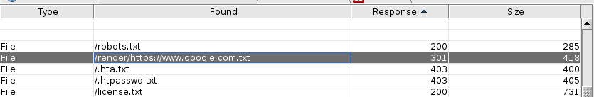
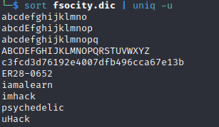
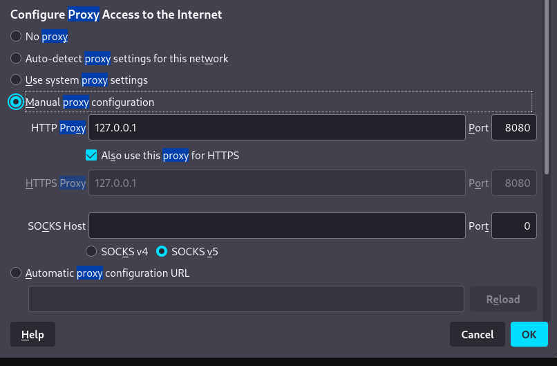
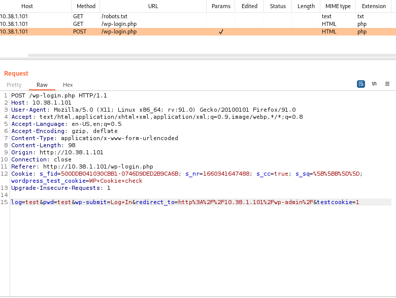

# Home Lap Hacking
- Now that we have the environment set up we can start hacking it
	- One of the most important and basic tools for a hacker is that of ==nmap==
	- Ones you have both of the machines running, you can run this nmap command `nmap -sT 10.38.100-110`. The IP should be the one that you put when you set up the internal network. The `-sT` command is used to scan TCP connect port using a 3 way handshake. 
	- If you want to be a little more sneaky since using a 3 way handshake establishes a connection you can use `-sS` instead which will not establish a connection and just peace out once it receives a SNY ACK which is a response from the server.
	- Once you scan it you should be able to see this
	
	- As you can see these are the ports that available
		- 22/tcp which is ssh (Secure Shell) which is a way to remotely connect to this server. As you can see its closed so we are unable to connect to in remotely
		- 80/tcp which is http (Hypertext Transfer Protocol) which is the port used to send and receive web applications. And its open
		- 443/tcp which is https (Hypertext Transfer Protocol Secure) which is the port used to send and receive web application. And its open
			- The difference between http and https is that the in:
				- http - the things that are send from it are unencrypted and have been fazed away ever since https
				- https -  is the same as http but its more secure. Every traffic that's send through it is encrypted making the port that we use today for web pages.
		- Since port 80 and 443 are open we should be able to connect to it trough a web page.
		- When you type in the IP address of the vuln machine in the web browser on the main machine you will get this.
		 
		- ## Attempt 1: Success
			- The first thing I did was try running all the commands that it tell me to run
			- Its should be obvious that the last command `join` will be the next step. When you type in the command `join` it asks for an email. The first thing I checked was if it has a way to check the format what the of the email that is being input, and there is. If you input anything things that isn't in the format of an email address it says invalid input.
		- ## Attempt 2: Success and Failure but we take these
			- So after trying the commands and nothing happened I thought it might have to get some other information using SQLi but I really don't like doing SQLi. So I tried something else first.
				- ### Attempt 1:
					- Recently I had learned about a program called gobuster and thought it might be a good idea to use it to figure out is there is any dir or files that are hidden but realized that gobuster isn't in the default version of kali and since I was in the internal network I couldn't connect to the internet to download it.
					- I then looked at a different type of program that does the same thing as gobuster and there was dirbuster which was installed as default in kali.
					- I then learned that dirbuster was the original of gobuster. But I find gobuster much easier to use and its much more simpler. 
					- At first I used dirbuster with a [common.txt](https://github.com/danielmiessler/SecLists/blob/master/Discovery/Web-Content/common.txt) which is a wordlist from SecList which has a bunch of wordlists for many different applications
					- But I didn't really know how dirbuster worked and I just left the options as default so the results of running dirbuster gave me a bunch of different dir and files that I didn't know how to look through. After this I thought there were no hidden dir or files and moved on to options.
					- After that failure I thought about doing SQLi but what ever I tried it didn't seam to work
					- So after being stuck for some time I thought about looking at some hints that were online and the first thing I saw was this
					
					- After seeing this I just stopped and stared at it wishing I had just downloaded gobuster.
					- After this fail I went back to dirbuster and tried again changing the options as well.
					- This was the settings that put on dirbuster
					
					- And lo and behold `robots.txt` is right there and an extra file names `license.txt`
					
					- And by opening `robots.txt` it gives you two files `fsocity.dic` and `key-1-of-3.txt`. If I had a more extensive wordlist I might have been able to go to `key-1-of-3.txt` with out the need for `robots.txt`. Opening `key-1-of-3.txt` gives me the first key. Great!
		- ## Attempt 3: 
			- We have the `license.txt` file but I feel like we will need to come back to this later.
			- So we will look in to `fsocity.dic` file instead.
				- .dic file is that of: I am not to sure my self. There isn't really anything that is explaining it in a simple term so I will just open it and see what it is. The way fileinfo.com explained it "Dictionary of words that can be referenced by word processors and other software programs; often used for spell-checking documents and providing correct spelling alternatives for misspelled words."
				- OK um, opening `fsocity.dic` gives me a bunch of words its over 850,000 lines long, and the first thing that came to my mind is that its a wordlist. It might be used for finding the password to log in to the vuln machine because when you open `robots.txt` it also shows `User-agent: *` maybe that the user name of the vuln machine. But since port 22 is closed I am unable to use hydra to crack the username and password since it would need an ssh connection in order for hydra to work. Hydra is a tool that's mostly used to crack passwords remotely.
		- ## Attempt 4:
			- Since I am unable to use hydra to crack the username and password for the vuln machine I tried looking at trying something else.
			- I then remembered that this web page was done using WordPress. I had learned what WordPress is and how it had so many vulnerabilities that specific tools were created to scan it as well. So I looked back at the dirbuster that I had ran and saw that there is a page that I can log in to but I would need the credentials and since I got that wordlist I should try cracking it.
			
			- So I got to learning how I could use hydra crack these credentials. 
				- ### Attempt 1: Fail
					- I needed some way to make the wordlist much smaller since having a wordlist with over 850,000 words would take for ever to go through using any credential cracking tool.
					- I learned that there is a simple way to sort text files but I don't know if it applies to .dic files as well. The command that I ran to remove duplicates was `sort fsocity.dic | uniq -u`. I was expecting there to a big difference but I **only got a total of 10 lines** removed wow.
					 
				- ### Attempt 2: Fail
					- Since I couldn't reduce the size of the wordlist at all I will just proceed with the use of hydra and see how long it says it will take. If the ET is far to long I will go back to the drawing board and try to reduce the size of the wordlist some other way.
					- From what I have seen in order to use hydra the way that I plan I will need the use of burpsuite and for that I will need to set that up.
					- So in order for burpsuite to work you will need to set a proxy and the browser that I am using is Firefox
					 
					- After capturing the WordPress login page I should now be able to send it to the intruder and start doing payload attacks. I could just use burpsuite and use the wordlist to do the attack but I think it would be better to use hydra instead.
					 
					- I have researched on how to use hydra and I have not been able to figure out why, what I am doing isn't working. The only conclusion that I could come to was that in order to use hydra there needs to be an internet connection since I think it has to connect back to its servers in order for it to work. I still haven't found any other tool I could you to crack this password with out the need for an internet connection.
					- I have just discovered another cracking tool called Ncrack. It might be able to work and its something I have to try out.
					- Never mind I got Hydra working
				- ### Attempt 3: Fail and Success
					- Ok so I got hydra working. It wasn't that it needed an internet connection for it to work it was just that I had a wrong syntax.
					- I had this `hydra -L /Downloads/fsocity.dic -P /Downloads/fsocity.dic 10.38.1.101 http-post-form "/wp-login.php/log=^USER^&pwd=^PASS^&wp-submit=Log+In&redirect_to=http%3A%2F%2F10.38.1.101%2Fwp-admin%2F&testcookie=1:Login in failed`
					- And when I ran this I got an error saying that hydra couldn't connect. This was the reason why I thought that I needed an internet connection for hydra to run but that wasn't the case
					- The correct command was `hydra -L fsocity.dic -P fsocity.dic 10.38.1.101 http-post-form "/wp-login.php:log=^USER^&pwd=^PASS^&wp-submit=Log+In&redirect_to=http%3A%2F%2F10.38.1.101%2Fwp-admin%2F&testcookie=1:Login in failed"` 
					- The problem was that I need to put `:` these at certain places. Also at the end it needs to say `Login in failed` and I had thought this was part of the URL that was input in the research that I had seen but today it clicked somehow that web logins wouldn't really way that.
					- So I got hydra running using the wordlist that I got and as expected it I ran it for an hour and it didn't look like it was even making a dent in the wordlist
				- ### Attempt 4: Fail
					- So since I am not able to use the wordlist the way it is I need to somehow reduce the size of the wordlist.
					- So I ran a couple of sort commands and I somehow got the wordlist down to 11k `sort -u -o sortedfsocity.dic fsocity.dic`. So I sorted it using -u and using -o put it in another file names sortedfsocity.dic and ran hydra using this wordlist.
					- So I think its still going to take a long time for hydra to run with the way I am doing it. Right now I have it so that both the username and the password uses the wordlist so that would be 11k^11k since every username would have to go through every password so for one username it would have to check 11k passwords and that's far to long to even comprehend. So if you remember when we opened robots.txt it said user-agent: * that might be a clue for something.
					- Ok lets hold of on that and lets get the correct username first. In WordPress if you can't log in you can as to change your password but you will need your username so I am going to try and use the wordlist for this. I couldn't get this to work. It seams that hydra needs a password parameter as well. So I am trying something else.
				- ### Attempt 5: Success
					- So I had to look at some hints in order to see how someone else might have done this part. It looks like they did basically what I did but made it so that hydra looks for the username only. Maybe because I don't have much experience but I can't tell how they knew that the response would be different if the username was correct. From everything I have seen one of the basic way to secure logins is that the response for if the password is correct or the username is correct should be the same. It shouldn't have a different response if the username is correct and the password is wrong. I don't think that it has something to do with how hydra works and its able to tell the difference between is the username is correct or the password. This was the commands that I used `hydra -L sortedfsocity.dic -p wedontcare 10.38.1.101 http-post-form "/wp-login.php:log=^USER^&pwd=^PASS^&wp-submit=Log+In:F=Invalid username" -V -f`. The last part where is ways F=Invalid username might be the part that can tell if the username is correct and the password is wrong but I am not sure.
					- But now that we have the username we should be able to use the wordlist now to find the password as well. This was the command that I used `hydra -l Elliot -P sortedfsocity.dic 10.38.1.101 http-post-form "/wp-login.php:log=^USER^&pwd=^PASS^&wp-submit=Log+In:F=is incorrect" -V -f`. I don't know why non of the other examples that I had looked at and research said anything about this F command. It looks like this F command is what the response. I think that hydra looks for this in the response to see if the its a part of it. If the command F is in the response it knows that the password isn't correct and if the F command isn't the same then that means the password is correct. And now we are able to see that we get both the username and password which is: Elliot: ER28-0652.
