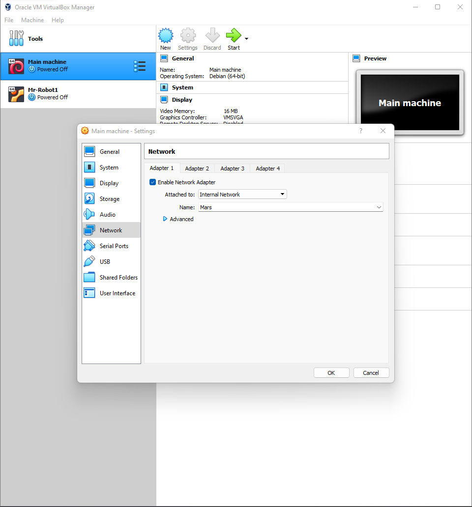

# Home Lab Setup
- This home lab was created so that I would be able to practice and learn how vulnerabilities work and be able to execute it as well
- ## Equipment needed
	- I did this using VirtualBox (You might be able to use VMWare as well but I don't think you would be able to keep the machines isolated using the free version of VMWare) and using a vulnerable machine from VulnHub.
- ## Isolating the Machines
	- Since you are downloading a vulnerable machine from VulnHub you don't know what the vulnerability is and how it might effect your host machine. If you download a vuln machine that you don't know about from an untrusted user you may leave your host open for an attack.
		- The way to isolate your machine is by making it so that the machines doesn't have access to the network that your host is in To do this you will need to do:
			- ## Step 1:
				- One of the most popular machines in VulnHub is Mr-Robot: 1 by Leon Johnson which is the machine that I first used to practice. Since its the most popular on if I was stuck on something there would be many resources that I could use to lead me in the right direction.
			- ## Step 2:
				- You now want to make it so that both the main machine and the vuln machine are on the same network and not connected to the host network.
				- To do this you would want to go to the setting of the machine and change the network settings to be ==Internal Network== and you can name it what ever you want. Both the main and the vuln machine should be in the same Internal Network
				  
			- ## Step 3:
				- Now that you have put them in the same internal network you will need to assign an IP address to them.
				- In order to do this you will need to set up an DHCP (Dynamic Host Configuration Protocol) Server
					- ### Step 1:
						- Open up your Command Prompt (I use PowerShell on Windows) and find where you have your VirtualBox is saved. If you saved it to the default location you should be able to open it using this `cd "/Program Files/Oracle/VirtualBox"` 
					- ### Step 2:
						- And then run this `.\vboxmanage dhcpserver add --network=Mars --server-ip=10.38.1.1 --lower-ip=10.38.1.100 --upper-ip=10.38.1.110 --netmask=255.255.255.0 --enable` 
					- ### Step 3:
						- What this will do is add a DHCP server to the internal network that you made (in my case it was Mars). It will make a server IP of 10.38.1.1 and the lower and upper parts are the amount of IP addresses there would be in this case there can be 10 IP in this network. The main machine should have a IP of 10.38.1.100 and the vuln machine should have a IP of 10.38.1.101.
			- ## Step 4:
				- Now you need to make sure that the VMs are isolated
					- In order to do that you can fire up the main machine and try and ping other the internet by pinging something like google.com
					- You can also check by pinging your the IP address of your host and see if it connects
					- Now fire up the vuln machine and using the main machine ping its IP address and you should get a response this shows that the machines are isolated from your host machine
